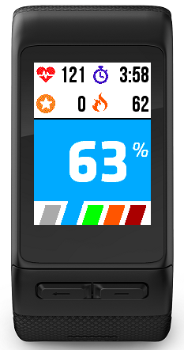
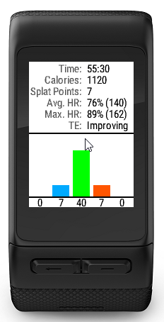
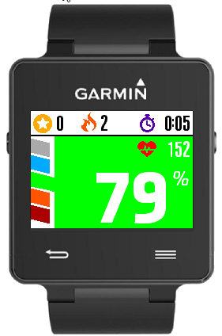
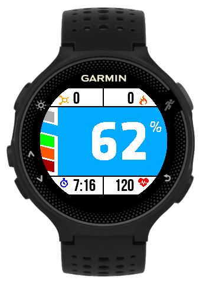
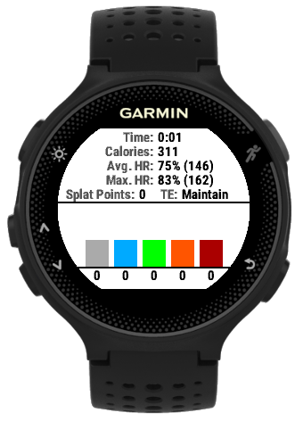
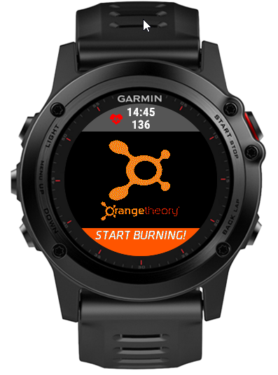
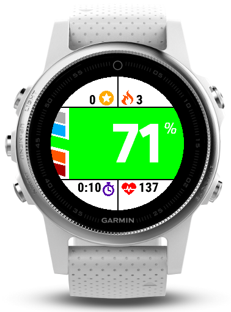
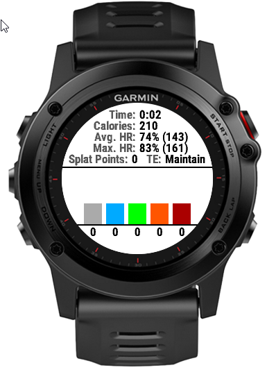

## Orange Theory Fitness App
**For Garmin Connect IQ**

**This App is Unofficial and was not created by [Orange Theory Fitness](http://www.orangetheoryfitness.com)**

### Description

This Garmin Connect IQ App provides a display on your Garmin Device which closely matches the display seen on the screens in Orange Theory Fitness studios.  It is intended to be used in-studio along with any of the official OTF heart rate monitors.  Devices equipped with internal HRM's can use this sensor as well but it is not as accurate.  By default the app will record an activity of type Treadmill Running but can be changed by the user.  This activity and it's FIT data can be saved and sync'd with Garmin Connect just as any other fitness tracking app does.

* [Orange Theory App on the Connect IQ Store](https://apps.garmin.com/en-US/apps/b886d2ac-2f94-4f9d-a7bd-85a59b99e639)

### Screenshots

**Tall**

**Rectangle**

**Semi-Round**

**Round**

### Supported Devices

* Vivoactive� HR
* Vivoactive�
* Forerunner� 920XT
* Forerunner� 230
* Forerunner� 235
* Forerunner� 735XT
* Forerunner� 630
* fenix� 3
* fenix� 3 HR
* fenix� 5S
* fenix� 5 Chronos
* D2� Bravo
* D2� Bravo Titanium
* tactix� Bravo
* quatix� 3

### How-To

**Menu Options and Settings**
*The menu can only be accessed while on the splash screen*

* Activity Type - Select the type of activity the workout will be recorded as.  The Activity Sub-Type setting only applies to the "Training" Activity.
* Heart Rate Zones - Choose between the official Orange Theory Zone model or your User Profile Defined Models
* Allow Vibration - Enable or Disable Vibration.  Enabling presents cues at start/stop of workout and when falling into the blue zone or going up into the orange/red zone

**Buttons and Interactions**
* On touchscreen devices tapping the screen will toggle the device back light (if equipped).
* Any button other than Back and Enter pressed outside of menus / prompts will toggle the backlight (if equipped).
* Back button on splash screen will exit the app
* Back button when the workout is active will pause the workout
* Back button on review page will exit the app
* Enter / Primary button on splash screen will start the workout
* Enter / Primary button during workout will pause the workout
* Enter / Primary button on review page will exit the app

**Prompts**
* If a Heart Rate is not detected upon starting the workout, user will be confirmed if they want to proceed.  App does not function without a heart rate but this assumes the user will attach their heart rate monitor after starting the workout.  This prompt will not be displayed on subsequent start/stop actions during a workout session.
* Upon stopping / pausing the workout a menu will be presented: Resume / Save / Discard.  These are fairly self-explanatory.  A back button pressed defaults to resume.
* Upon saving the activity a workout summary screen will be displayed.  The back or enter button on this screen will exit the app.

### To Do and Planned Features

* Support Additional Devices
* Potentially allow for manual activity selection / switching during a workout

### Bugs and Feature Requests

To report a bug or request a feature please use the Github issue tracker associated with this repository. 

### Calculations and Accuracy

The output of this app should very closely match that of the OTF Workout Summary.  It may not be exact in all cases and is meant to be as close as possible.

* Max HR is calculated as per Orange Theory's method which is: (230 - Age) for Females and (225 - Age) for Males
* HR Zone Thresholds are: Blue - 61%, Green 71%, Orange 84%, Red 92%
* Calories Burned are calculated using Garmin's algorithms, not OTF's.  This is because I do not know how to override that field in the FIT recording file.
* Splat Points are the total time in seconds in the Orange + Red Zones, rounded to the nearest minute.
* Splat Points are usually 1-2 low for the duration of the workout.  I believe this is because I use BPM to calculate time in zone and OTF might use percentage which is rounded.

### Development

Source code is made available under the [MIT license](https://opensource.org/licenses/MIT).

Pull requests and translations are welcomed!

### Version History and Changelog

*This app is tested on a Garmin Vivoactive� HR*

**v1.2.2 - 6/16/2017**

* Added Fenix 5S and Fenix Chronos Support
* Added Round 240x240 Watch support

**v1.2.1 - 6/16/2017**

* Added Fenix 3 and other round watch support
* Fixed an issue with incorrect version build uploaded for 1.2.0

**v1.2.0 - 6/15/2017**

* Added setting to allow user selection of the activity recording type.  Now defaults to Treadmill Running
* Vibration Updates, changed vibration profiles to be more easily recognizable as to what they mean
* Prevent back-to-back vibration events when heart rate is going between two zones relatively quickly

**v1.1.2 - 6/15/2017**

* Forerunner 630 Support
* Corrections to custom FIT field for Splat Points
* Additional HR profile settings
* Memory optimizations
* Fix reloading of changes to settings

**v1.1.1 - 6/14/2017**

* Fixed a bug in the review screen where test bars were left in place
* Improved button handling

**v1.1.0 - 6/13/2017**

* Updated code to be compatible with CIQ SDK 2.3.1
* Memory footprint optimizations
* Added support for Vivoactive
* Added support for Forerunner 920XT, 230, 235, 735XT

**v1.0.3 - 6/11/2017**

* Memory optimizations
* Re-factored a lot of code to be more portable across various devices

**v1.0.2 - 6/9/2017**

* Removed an un-needed permission
* Fixed a bug when closing/clearing sensors
* Added some additional logging points for debugging

**v1.0.1 - 6/5/2017**

* Fixed a type casting issue on HR percentage
* Changed the splat point calculation to be more accurate
* Updated screenshots

**v1.0.0 - 6/3/2017**

* Initial Release

